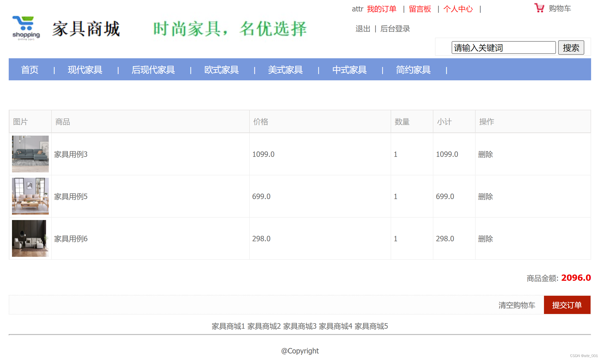

# 基于SSM的家具销售商城系统设计与实现

#### 介绍
前端：JSP；
后台：SSM；
数据库：MySQL；
    家具销售商城基整合了Spring、SpringMVC、Mybatis框架对系统后台进行了开发，前端则采用了JSP技术实现了页面的动态数据展示。家具销售商城作为B2C项目，前台用户核心功能包括加入购物车、下单、个人订单管理等；后台则主要负责对基础数据的维护管理工作。

#### 需求分析
##### 系统管理员模块
1.  会员管理：由于系统管理员需要查看系统的人流量且需要维护会员的个人信息，所以系统管理员需要对系统注册会员进行管理功能。
2.  商品类别管理：系统管理员在后台可以对商品进行分类管理，有商品一级、二级管理。
3.  商品管理：系统管理员可对系统内所有的商品进行管理，包括商品信息的修改或商品下架等。
4.  订单管理：系统为管理者提供了统计盈亏情况的管理订单模块，其主要包括对订单分类查询、发货等操作。
5.  留言板管理：系统管理员可以在系统后台查看客户的留言信息，并且对于一些不友好的留言信息可以进行删除。
##### 系统会员模块
1.  会员注册：非会员用户可在系统内进行注册从而成为会员。
2.  系统登录：客户在注册成为系统会员后，可进行登录系统。
3.  浏览商品信息：客户在进入系统首页后，可浏览当前的热门、最新的商品信息，也可输入关键字进行查询商品。
4.  加入购物车：客户在商品详情页中可将自己所选的商品加入到购物车中。
5.  提交订单：客户可在购物车中提交订单并录入相关的个人信息后确认订单。
6.  查看个人订单：系统会员可查看个人的所有订单。
7.  发布留言：系统会员可在系统留言板内发布留言信息。

#### 系统截图

1.  
2.  
3.  
4.  
5.  
6.  
7.  
8.  
9.  
10. 

#### 需要源码请加微信：945130012（请备注来意，谢谢）
